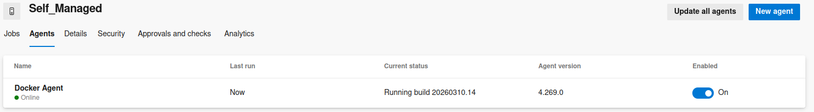
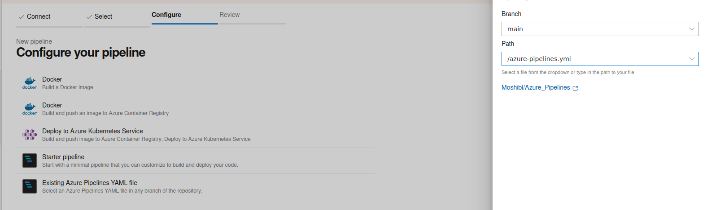
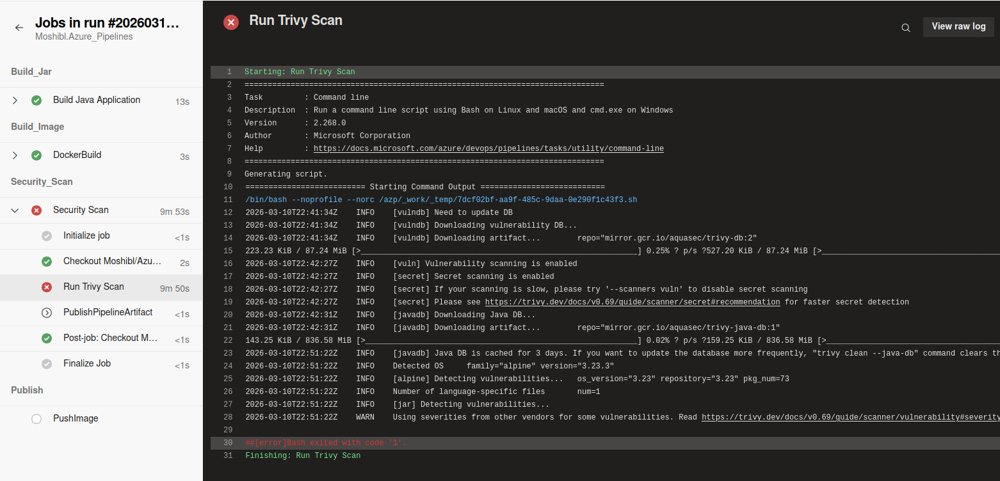
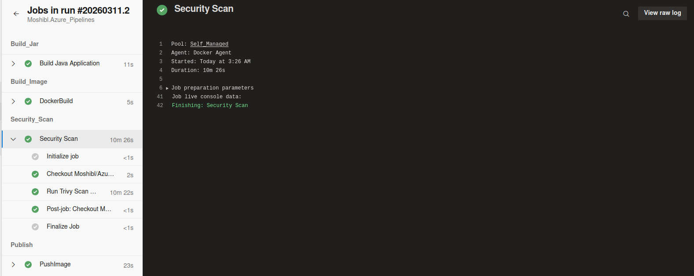
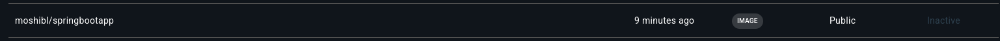

# Azure_Pipelines

## 🧱 Project Overview

This Repository features a comprehensive Azure DevOps Pipeline setup, Emphasizing on Modular template-based configuration, and utilizing Trivy for Image vulnerability scanning.

---

## 🛠 Technologies Used

- Git
- Azure DevOps - Pipelines
- Trivy
- Docker

---

## 📂 Directory Structure

```
.
project-root
│
├── demo/                  # Spring Boot app
│   ├── dockerfile
│   └── pom.xml
│
├── azure-pipelines.yml
│
└── templates
    ├── Jar_Build.yml
    ├── Image_Build.yml
    └── Trivy-Scan.yml
```
---

## 🚀 Project Steps

### 1. Set up a Docker-based Azure Pipelines Agent

# Please Refer to https://learn.microsoft.com/en-us/azure/devops/pipelines/agents/docker?view=azure-devops for more details.

We begin by provisioning the infrastructure using Terraform.

```bash
mkdir ~/azp-agent-in-docker/
cd ~/azp-agent-in-docker/
```
Create the agent Dockerfile with necessary Packages

```Docker
FROM python:3-alpine
ENV TARGETARCH="linux-musl-x64"

# Another option:
# FROM arm64v8/alpine
# ENV TARGETARCH="linux-musl-arm64"

RUN apk update && \
  apk upgrade && \
  apk add bash curl gcc git icu-libs jq musl-dev python3-dev libffi-dev openssl-dev cargo make openjdk17 maven docker-cli


# Set Java environment variables required by Azure Pipelines
ENV JAVA_HOME=/usr/lib/jvm/java-17-openjdk
ENV JAVA_HOME_17_X64=/usr/lib/jvm/java-17-openjdk
ENV PATH=$PATH:$JAVA_HOME/bin

# Install Azure CLI
RUN pip install --upgrade pip
RUN pip install azure-cli

WORKDIR /azp/

COPY ./start.sh ./
RUN chmod +x ./start.sh

#RUN adduser -D agent
#RUN chown agent ./
#USER agent
# Another option is to run the agent as root.
ENV AGENT_ALLOW_RUNASROOT="true"

ENTRYPOINT [ "./start.sh" ]
```
Create the start.sh Script which starts the container

```bash
#!/bin/bash
set -e

# -----------------------------
# 0. Validate required env vars
# -----------------------------
if [ -z "${AZP_URL}" ]; then
  echo 1>&2 "error: missing AZP_URL environment variable"
  exit 1
fi

if [ -z "${AZP_TOKEN}" ] && [ -z "${AZP_CLIENTID}" ]; then
  echo 1>&2 "error: missing AZP_TOKEN or service principal credentials"
  exit 1
fi

# -----------------------------
# 1. Login via service principal (optional)
# -----------------------------
if [ -n "${AZP_CLIENTID}" ]; then
  echo "Using service principal credentials to get token"
  az login --allow-no-subscriptions \
           --service-principal \
           --username "$AZP_CLIENTID" \
           --password "$AZP_CLIENTSECRET" \
           --tenant "$AZP_TENANTID"

  AZP_TOKEN=$(az account get-access-token --query accessToken --output tsv)
  echo "Token retrieved"
fi

# -----------------------------
# 2. Save token to file
# -----------------------------
if [ -z "${AZP_TOKEN_FILE}" ]; then
  AZP_TOKEN_FILE="/azp/.token"
  echo -n "${AZP_TOKEN}" > "${AZP_TOKEN_FILE}"
fi

unset AZP_CLIENTSECRET
unset AZP_TOKEN

# -----------------------------
# 3. Create work folder
# -----------------------------
if [ -n "${AZP_WORK}" ]; then
  mkdir -p "${AZP_WORK}"
fi

# -----------------------------
# 4. Cleanup function
# -----------------------------
cleanup() {
  trap "" EXIT
  if [ -e ./config.sh ]; then
    echo "Cleanup. Removing Azure Pipelines agent..."
    while true; do
      ./config.sh remove --unattended --auth "PAT" --token $(cat "${AZP_TOKEN_FILE}") && break
      echo "Retrying in 30 seconds..."
      sleep 30
    done
  fi
}

trap "cleanup; exit 0" EXIT
trap "cleanup; exit 130" INT
trap "cleanup; exit 143" TERM

export VSO_AGENT_IGNORE="AZP_TOKEN,AZP_TOKEN_FILE"

# -----------------------------
# 5. Download and extract agent
# -----------------------------
echo "Determining latest Azure Pipelines agent..."
AZP_AGENT_PACKAGES=$(curl -LsS -u user:$(cat "${AZP_TOKEN_FILE}") \
  -H "Accept:application/json" \
  "${AZP_URL}/_apis/distributedtask/packages/agent?platform=${TARGETARCH}&top=1")

AZP_AGENT_PACKAGE_LATEST_URL=$(echo "${AZP_AGENT_PACKAGES}" | jq -r ".value[0].downloadUrl")

if [ -z "${AZP_AGENT_PACKAGE_LATEST_URL}" ] || [ "${AZP_AGENT_PACKAGE_LATEST_URL}" == "null" ]; then
  echo 1>&2 "error: could not determine a matching Azure Pipelines agent"
  exit 1
fi

echo "Downloading and extracting Azure Pipelines agent..."
curl -LsS "${AZP_AGENT_PACKAGE_LATEST_URL}" | tar -xz

# Load environment variables from agent package
source ./env.sh

# -----------------------------
# 6. Configure agent
# -----------------------------
echo "Configuring Azure Pipelines agent..."
./config.sh --unattended \
  --agent "${AZP_AGENT_NAME:-$(hostname)}" \
  --url "${AZP_URL}" \
  --auth "PAT" \
  --token $(cat "${AZP_TOKEN_FILE}") \
  --pool "${AZP_POOL:-Default}" \
  --work "${AZP_WORK:-_work}" \
  --replace \
  --acceptTeeEula

# -----------------------------
# 7. Run agent
# -----------------------------
echo "Running Azure Pipelines agent..."
chmod +x ./run.sh
./run.sh "$@"

```
Build the Agent docker image from the docker file using the following command


```bash
docker build --tag "azp-agent:linux" --file "./azp-agent-linux.dockerfile" .
```

Run an agent from the image using the following Docker command

```bash

docker run -e AZP_URL="<Azure DevOps instance>" -e AZP_TOKEN="<Personal Access Token>" -e AZP_POOL="Self_Managed" -e AZP_AGENT_NAME="Docker Agent" -e AGENT_ALLOW_RUNASROOT="true" -v /var/run/docker.sock:/var/run/docker.sock --name "azp-agent-linux" azp-agent:linux

```
Verify that the agent is online and Running 


---

### 2. Create the Pipeline Templates for reusability and utilizing Parameters

Yaml for Building the Jar Artifact

```yaml
jobs:
- job: BuildJava
  displayName: Build Java Application

  steps:
  - task: Maven@4
    inputs:
      mavenPomFile: 'demo/pom.xml'
      goals: 'clean package'
      options: '-DskipTests'
      javaHomeOption: 'JDKVersion'
      jdkVersionOption: '1.17'
```

Yaml for Building Docker Image

```yaml
parameters:
  imageName: ''
  tag: ''

jobs:
- job: DockerBuild

  steps:
  - script: |
      docker build -t ${{ parameters.imageName }}:${{ parameters.tag }} demo
    displayName: Build Docker Image
```

Yaml for Trivy Scan

```yaml
parameters:
  imageName: ''
  tag: ''

jobs:
- job: TrivyScan
  displayName: Security Scan

  steps:
  - script: |
      mkdir -p /azp/_work/1/a/trivy

      docker run --rm \
        -v /var/run/docker.sock:/var/run/docker.sock \
        -v /azp/_work/1/a/trivy:/report \
        aquasec/trivy image \
        --severity HIGH,CRITICAL \ 
        --format json \
        --output /report/trivy-report.json \
        --timeout 10m \
        ${{ parameters.imageName }}:${{ parameters.tag }}

      VULN_COUNT=$(jq '[.Results[].Vulnerabilities[]? | select(.Severity=="HIGH" or .Severity=="CRITICAL")] | length' $(Build.ArtifactStagingDirectory)/trivy/trivy-report.json)
      echo "Number of HIGH/CRITICAL vulnerabilities: $VULN_COUNT"

      if [ "$VULN_COUNT" -gt 0 ]; then
        echo "❌ High/critical vulnerabilities found. Failing pipeline."
        exit 1
      else
        echo "✅ No HIGH/CRITICAL vulnerabilities found."
      fi
    displayName: Run Trivy Scan and Enforce Quality Gate

  - task: PublishPipelineArtifact@1
    inputs:
      targetPath: '$(Build.ArtifactStagingDirectory)/trivy/trivy-report.json'
      artifact: 'TrivyScanReport'
      publishLocation: 'pipeline'
```


---

### 3. The Main Pipeline

The main Pipeline where all templates are integrated.

```yaml

trigger: #Triggered by Pushes on the git main branch
- main

variables:
  imageName: moshibl/springbootapp
  tag: $(Build.BuildId)

pool:
  name: Self_Managed #The Self-Hosted Docker Agent

# Template Stages and making using of parameters
stages:
- stage: Build_Jar
  jobs:
  - template: templates/Jar_Build.yml

- stage: Build_Image
  dependsOn: Build_Jar
  jobs:
  - template: templates/Image_Build.yml
    parameters:
      imageName: $(imageName)
      tag: $(tag)

- stage: Security_Scan
  dependsOn: Build_Image
  jobs:
  - template: templates/Trivy_Scan.yml
    parameters:
      imageName: $(imageName)
      tag: $(tag)

- stage: Publish
  dependsOn: Security_Scan
  jobs:
  - job: PushImage
    steps:
    - task: Docker@2
      displayName: 'Login and Push Docker Image'
      inputs:
        containerRegistry: 'Dockerhub'  # Name of the service connection
        repository: 'moshibl/springbootapp'    # DockerHub repo
        command: 'push'
        tags: '$(tag)'

```
---

### 4. Create the pipeline

We then create a **Pipeline** in Pipelines Dashboard:

- Create A new Pipeline.
- Connect to github.
- Choose Existing Pipeline in the Repo



---

### 5. Test The pipeline

The Pipeline is Triggered by Git push on the repo, upon Pipeline trigger, the following occurs:

- Build the new artifact
- Build a new Image
- Scan the Image and generate a report
- Push the Image to dockerhub on Success
- Job status sent to Slack


Testing the Failure on Trivy quality gate Violate



Testing on Success

---

### 6. Verifying the Image push on Success

Once the Image is successfully pushed, we verify by checking DockerHub



---

## 📌 Summary

- **Create A Self-Hosted Docker Agent**
- **Create a Modular-Reusable Pipeline**
- **Use Trivy to manage Image Push**
- **Verify**

---

## 🧑‍💻 Author

**Mohamed Shibl** <br>
🔗 [LinkedIn](https://www.linkedin.com/in/mohamed-gshibl/) <br>
📧 [mohamed.gshibl@gmail.com](mailto:mohamed.gshibl@gmail.com)
